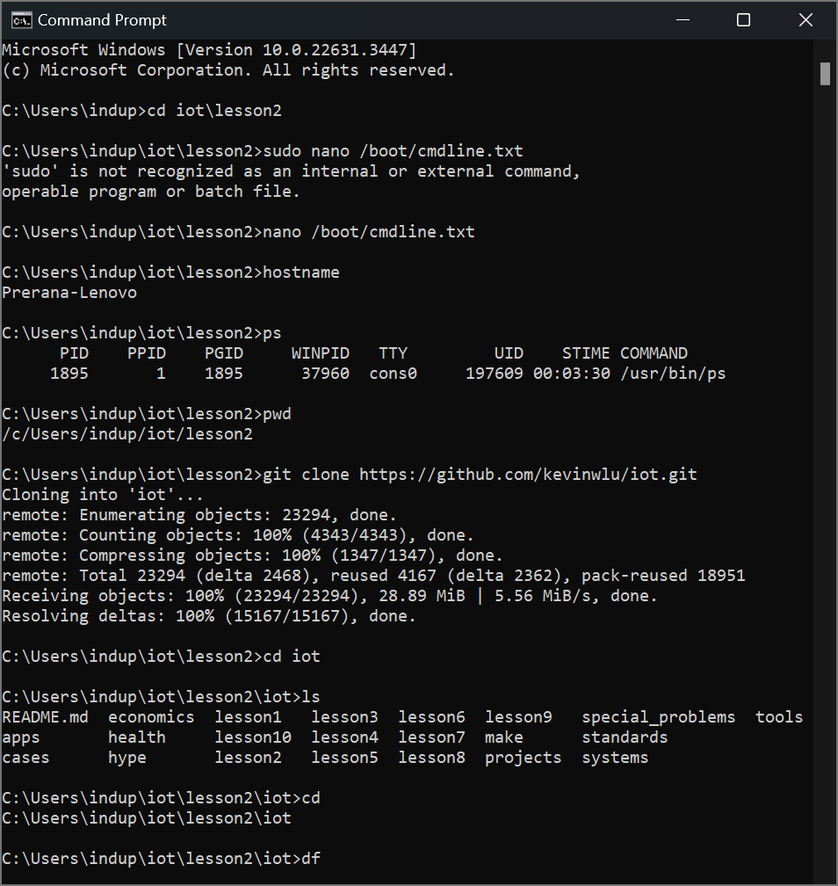
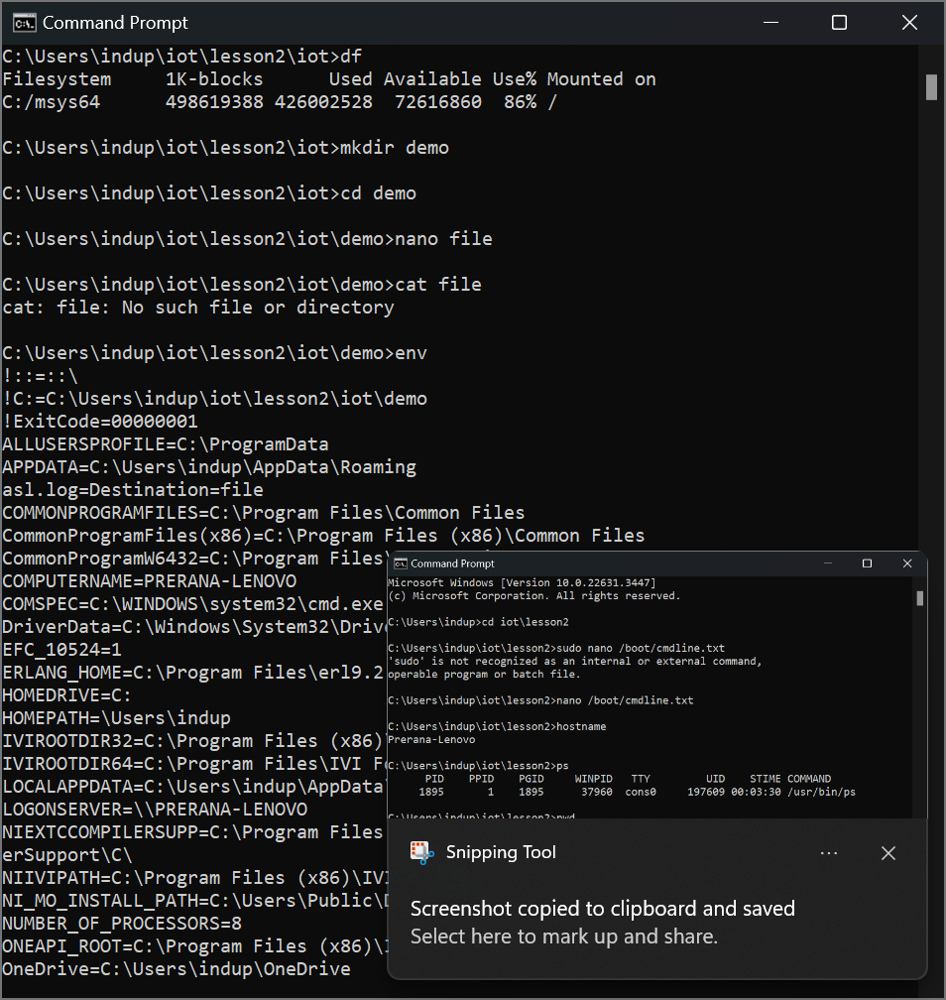
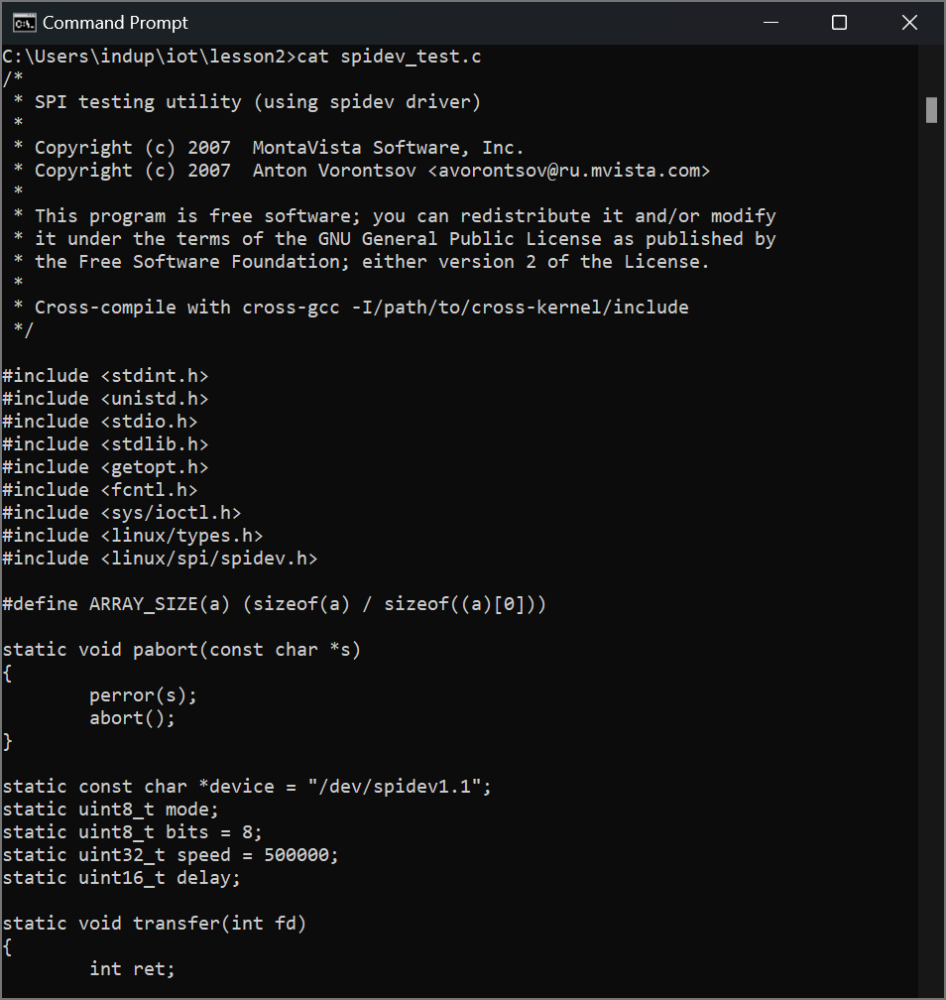
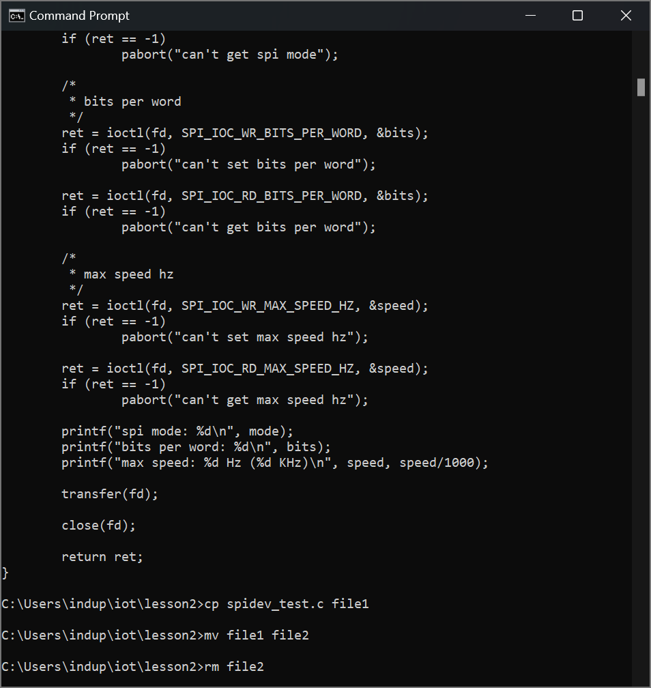
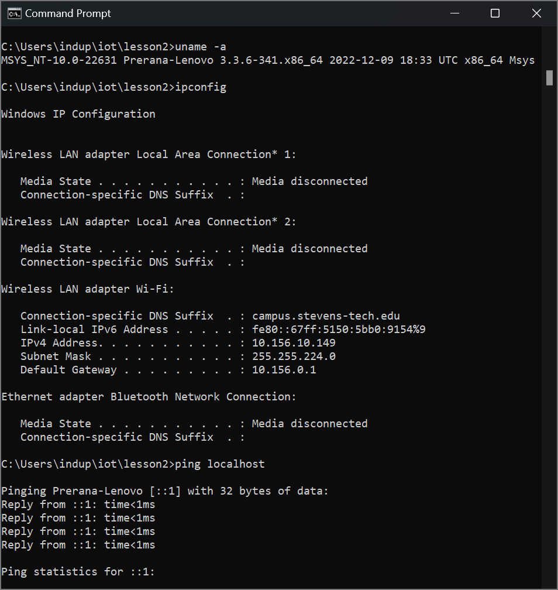

# Lab 2
```python
nano
```
***allows users to edit code***
```python
hostname
```
***displays name of user***
```python
ps
```
```python
pwd
```
***displays path***
```python
cd
```
***enter directory***
```python
mkdir
```
***create directory***
```python
cat
```
***display files contents***
```python
env
```
***environment variables***
```python
cp
```
***copies file***
```python
mv
```
***moves file***
```python
rm
```
***removes file***
```python
cd
```
***enter directory***
```python
uname -a
```
***displays device name***
```python
ipconfig
```
***IP Configuration***
```python
ping localhost
```
***ping stats***





