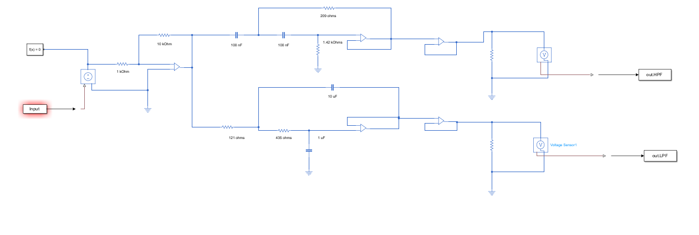

# *Design VI*

Lecture-Lab-Study: 1-3-2

Credits: 2

## Summary
My name is Pre Putrevu, and I am a 4/5 Computer Engineering Student here at Stevens Tech. I am excited for all the learning opportunities Design VI has to offer. 😁

## Past Projects 

### ==Python Card Game==
```python
class Card:
 suit_list = ["Clubs", "Diamonds", "Hearts", "Spades"]
 rank_list = ["none", "Ace", "2", "3", "4", "5", "6", "7", "8", "9", "10", 
"Jack", "Queen", "King"]
 def __init__(self, suit=0, rank=2):
 self.suit = suit 
 self.rank = rank
 def __str__(self):
 return (self.rank_list[self.rank] + " of " + self.suit_list[self.suit])
 def __eq__(self, other): 
 return (self.rank == other.rank and self.suit == other.suit)
 def __gt__(self, other):
 if self.suit > other.suit:
 return True
 elif self.suit == other.suit:
 if self.rank > other.rank:
 return True
 return False
 
class Deck:
 def __init__(self):
 self.cards = []
 for suit in range(4):
 for rank in range(1, 14):
 self.cards.append(Card(suit, rank))
 def __str__(self):
 s = ""
 for i in range(len(self.cards)):
 s = s + i * " " + str(self.cards[i]) + "\n"
 return s
 def shuffle(self):
 n_cards = len(self.cards)
 for i in range(n_cards):
 j = random.randrange(0, n_cards)
 self.cards[i], self.cards[j] = self.cards[j], self.cards[i]
 def pop_card(self): 
 return self.cards.pop()
 def is_empty(self):
 return len(self.cards) == 0
 def deal(self, hands, n_cards = 52):
 n_players = len(hands)
 for i in range(n_cards):
 if self.is_empty():
 break
 card = self.pop_card()
 current_player = i % n_players
 hands[current_player].add_card(card)
```
### ==Amplifier and Crossover Filter Network==


## Class Details
**Meeting Time**: Monday 10:00 AM to 11:50 AM

**Location**: Babbio Center 104

**Instructor**: Dr. Kevin Lu

## Course Schedule 2024 Spring
1. 2024-01-22 Lesson 0: Syllabus
2. 2024-01-29 Lesson 1: Overview
3. 2024-02-05 Lesson 2: Needs Assessment
4. 2024-02-12 Lesson 3: Structuring the Search for the Problem
5. 2024-02-21 (Wednesday) Lesson 4: Structuring the Search for a Solution
6. 2024-02-26 Lesson 5: Acquiring, Applying, and Protecting Technical Knowledge
7. 2024-03-04 Lesson 6: Abstraction and Modeling
8. 2024-03-11 No Class (Spring Recess)
9. 2024-03-18 Lesson 7: Synthesis
10. 2024-03-25 Lesson 8: Ethics and Product Liability
11. 2024-04-01 Lesson 9: Hazards Analysis and Failure Analysis
12. 2024-04-08 Lesson 10: Design Analysis
13. 2024-04-15 Lesson 11: Implementation
14. 2024-04-22 Lab Review
15. 2024-04-29 Lab Review
16. 2024-05-06 Lab Due

## Course Learning Outcomes
### Program Outcome 1: Complex Problem Solving
- 1.3 (Engineering foundations) Students will be able to use block diagrams and a hierarchical representation of the project and use detailed circuit diagrams and interconnected component diagrams with technical specifications on inputs, outputs, and control to describe the detailed operation of components in the project.

### Program Outcome 2: Design
- 2.1 (Design assessment) Students will be able to design a system or process with considerations of economic, environmental, health and safety, manufacturability, and sustainability constraints.
- 2.2 (Technical design) Students will be able to explore the design space of performance, features, and cost to determine the cost (fixed and operating) of a given project "product."
- 2.3 (Technical design) Students will be able to adjust the overall design of a project by changing or adding a component, developing a representation of the initial understanding of the project design and evolving it to a detailed representation that establishes a "design, test, and build" process based on inputs, outputs, and variables defined by successive levels (hierarchical) of components and subsystems.
- 2.4 (Design assessment) Students will be able to critically evaluate the impact of cost, features, and performance on the useful functionality of a project "product" from the perspective of a non-technical customer and will understand the importance of critically challenging his/her design and use assumptions to ensure exploration of alternative designs and features from the perspective of a final customer product.
- 2.5 (Technical design) Students will be able to develop the design for a project using a hierarchical approach (top-down) and to apply successive refinement to their design, incorporating new information and insights into your design while adjusting the overall design for necessary changes.
- 2.6 (Design assessment) Students will be able to understand and apply the principles of concurrent design in the breakdown of tasks and project plans and will understand and apply Gantt chart and PERT/CPM (either or both) in the creation of a breakdown of tasks and planning the activities to complete the project.
- 4.1 (Social issues) Students will be able to explore the non-technical space of social requirements, with a particular concern for the social impacts (both favorable and unfavorable) of their project "product."

### Program Outcome 3: Communications
- 3.1 (Communication) Students will be able to write technical reports with sufficient clarity and accuracy.

### Program Outcome 4: Ethical and Professional Conduct
- 4.2 (Ethics and morals) Students will be able to understand the associated ethical issues.
- 4.3 (Professionalism) Students will be able to understand the associated professional responsibilities.

### Program Outcome 5: Teamwork and Leadership
- 5.1 (Teamwork) Students will be prepared to effectively participate in and manage a multidisciplinary design team.
- 5.2 (Teamwork) Students will participate in a modest-sized team to develop initial ideas into a full project, with the final objectives of the team evolving from the collaboration rather than being defined a-priori.

### Program Outcome 6: Ability to Learn
- 1.1 (Tools) Students will be familiar with the use of standard search engines and keywords for an undirected search for information relevant to a specific project, familiar with the use of directed searches, starting from a known-good site and searching for information at that site relevant to a specific project and familiar with resources for compression/decompression of information.
- 1.2 (Tools) Students will be able to efficiently locate information describing and assessing software tools for exploring the mathematical algorithms and techniques that are embedded in a student project.

